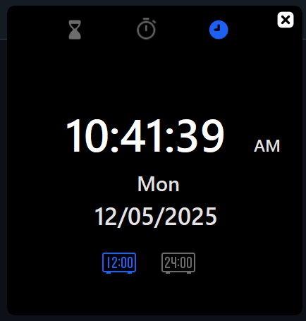
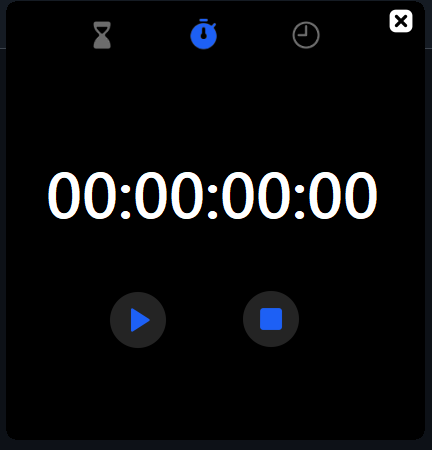
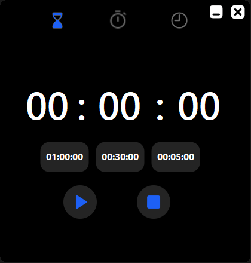

# ⏰ Time-Manager-Project

The **Time-Manager-Project** is a simple and elegant desktop application designed to help users manage their time effectively. It includes three core features: a real-time **Clock**, a functional **Stopwatch**, and a customizable **Countdown Timer**. Its user-friendly dark-themed interface provides a pleasant and focused experience.

---

## 🧩 Features

<h3>🕒 Clock</h3>

- Displays the current **time**, **day**, and **date**.
- Supports both **12-hour** and **24-hour** formats with a toggle option.
- Clean digital design for quick time checks.

---

<h3>⏱️ Stopwatch</h3>

- Simple start, stop, and reset functionality.
- Time displayed in `HH:MM:SS:MS` format.
- Ideal for tracking activity duration.

---

<h3>⌛ Countdown Timer</h3>

- Set countdown duration manually or use quick-pick buttons (`1:00:00`, `0:30:00`, `0:05:00`).
- Large, centered display with easy controls.
- Perfect for work sessions or reminders.

---

## 📂 Project Structure

